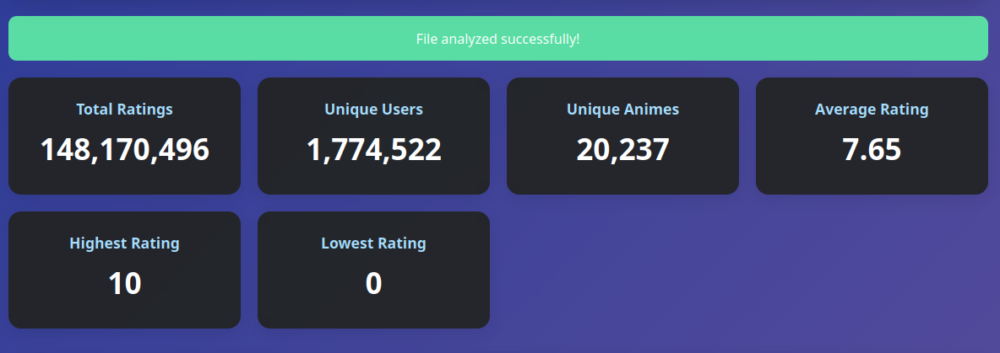
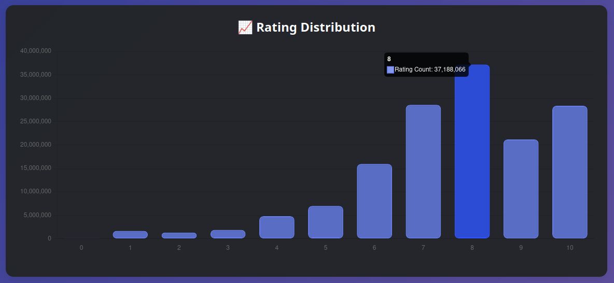
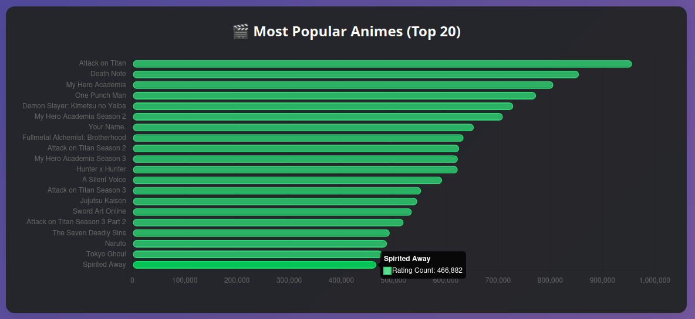

# Movielens Anime Dataset

## About Dataset

This dataset consists of user ratings for anime titles. Each user in the dataset has provided at least 5 ratings, ensuring a minimum level of engagement. The dataset includes detailed information about both users and anime, making it suitable for tasks such as recommendation systems, user behavior analysis, and genre-based filtering. Dataset is freshly-created so it cover newer animes. Data is provided in the MovieLens format except timestamp column. With minor modifications, the dataset can be used in any recommendation project that utilizes the MovieLens dataset. I was able to train BERT model in https://github.com/jaywonchung/BERT4Rec-VAE-Pytorch project with some small modifications.

## Dataset Statistics

  - Number of Users: 1,774,522
  - Number of Animes: 20,237
  - Total Ratings: 148,170,496
  - Sparsity/Density: 0.0041
  - Average Ratings per User: ~83.50
  - Average Ratings per Anime: ~7,321.76
  - Rating Range: 0.1 to 10.0
  - Mean Rating: 7.64
  - Standard Deviation of Ratings: 1.89

## Anime Metadata

**Each anime entry includes:**

 - Title
 - Year of release
 - Episode Count
 - Type (e.g., TV, Movie, OVA)
 - Score (aggregated or average rating)
 - Image URL (for visual reference)
 - MyAnimeList URL
 - Genres Detailed Genres

## Download
Dataset available on kaggle https://www.kaggle.com/datasets/tavuksuzdurum/user-animelist-dataset

## Statistics

